# Ranking Activities AI for Moodle

The **Ranking Activities AI** plugin empowers students to rate course activities and resources, transforming simple feedback into **meaningful, AI-powered insights** for teachers and administrators.  

Using the **DataCurso AI Provider**, this plugin connects directly to powerful AI services that analyze student ratings and feedback to provide **actionable summaries and visual reports** that enhance teaching quality and course design.  

Educators can instantly generate AI-based analyses of student engagement and satisfaction, while administrators gain valuable data about how activities perform across courses.

## Key Features

- **Student Activity Ratings** – Allow students to rate each course activity or resource with a clean, user-friendly interface.  
- **AI-Powered Analysis** – Automatically summarize and interpret ratings to uncover trends, strengths, and improvement areas.  
- **Visual Reports** – Display summarized insights and AI-generated feedback directly within the course.  
- **Seamless Integration** – Works in sync with the **DataCurso AI Provider**, using your Moodle AI token credits.  
- **Instructor Insights** – Provide teachers with quick, data-driven overviews to improve content and engagement.  

## Pre-requisites

1. Moodle 4.5  
2. Install the Moodle AI provider **“DataCurso AI Provider”**. Download it for free from [https://moodle.org/plugins/aiprovider_datacurso/versions](https://moodle.org/plugins/aiprovider_datacurso/versions).  
3. In the **DataCurso AI Provider** settings, configure a valid license key as documented at [https://docs.datacurso.com/index.php?title=Datacurso_AI_Provider#Getting_license_keys](https://docs.datacurso.com/index.php?title=Datacurso_AI_Provider#Getting_license_keys).  

**IMPORTANT:** This plugin will not function unless the **DataCurso AI Provider** plugin is installed and licensed.

## Installing via uploaded ZIP file

1. Log in to your Moodle site as an admin and go to `Site administration > Plugins > Install plugins`.  
2. Upload the ZIP file containing the plugin code. You will only be prompted to add details if your plugin type is not automatically detected.  
3. Review the plugin validation report and finish the installation.

## Installing manually

You can also install this plugin manually by copying its contents into:

```
{your/moodle/dirroot}/local/datacurso_ratings
```

Then log in to your Moodle site as an admin and go to  
`Site administration > Notifications` to complete the installation.

Alternatively, from the command line:

```bash
php admin/cli/upgrade.php
```

## Plugin Configuration

Once installed, configure the plugin as follows:

1. Log in as an admin.  
2. Go to any Moodle course and open the **Ranking Activities AI** section.  
3. Ensure the **DataCurso AI Provider** plugin is active and licensed.  
4. Students can start rating activities; teachers and admins can generate AI-based analyses using the “Generate AI Analysis” button.  

## Example Use

After collecting student ratings, educators can click **“Generate AI Analysis”** to obtain:
- AI-generated summaries of overall course quality.  
- Highlighted strengths and weaknesses of specific activities.  
- Insights into engagement and perceived learning value.  


# Administration Panel Plugin

1. Go to **Administration** under the **Plugins** section.

   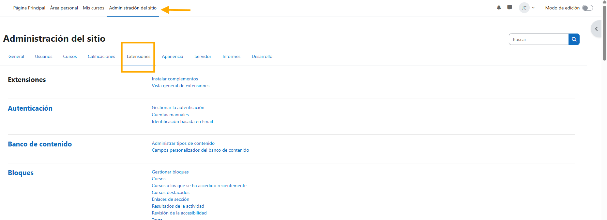

2. Find **Local Plugins** and locate the **Ranking Activities AI** links. Here you will find
   three links related to this plugin:

   - Manage predefined responses
   - General ratings report
   - General settings

   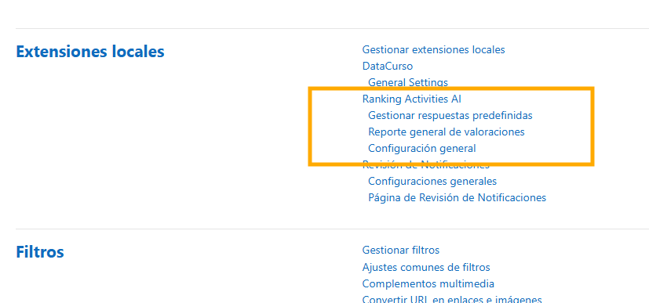

3. **General Settings**  
   - This section allows you to enable or disable the plugin’s visibility in courses.

   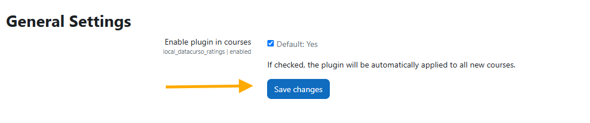

4. **Manage Predefined Responses**  
   - This page lets you add predefined responses that students can choose from when rating activities or resources.

   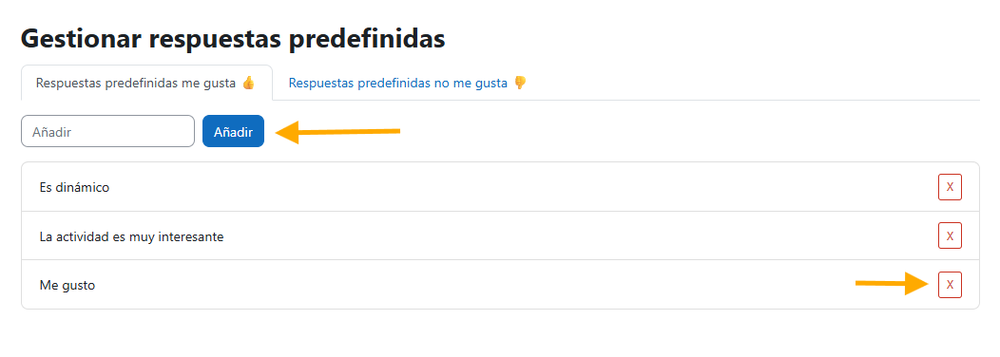

5. **General Ratings Report**  
   - On this page, administrators can view a comprehensive report of all student ratings across every course activity.

   

   - By clicking the **Generate Analysis** button, the AI will create an analysis based on the global data gathered from all information.

   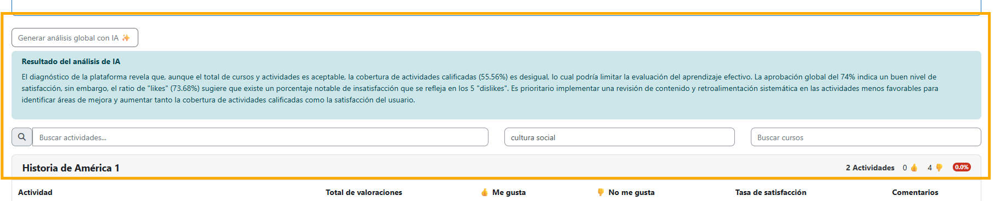

   - When viewing the comments of a specific activity, you can also generate an AI analysis of the comments.

   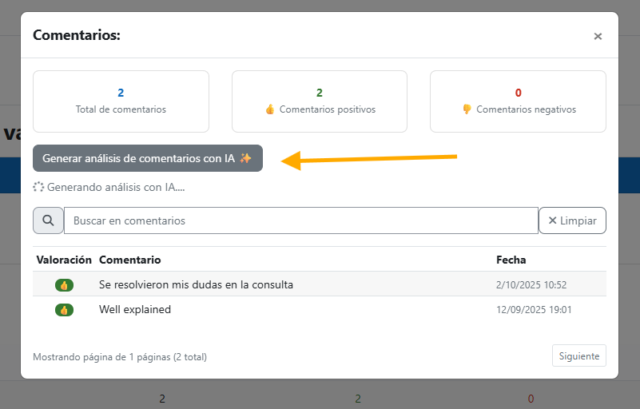

## Student Rating

1. When a student enters an activity or resource, they will see the following buttons:
   - When selecting **Like** or **Dislike**, a set of predefined responses will appear for the student to choose from and submit their feedback.

   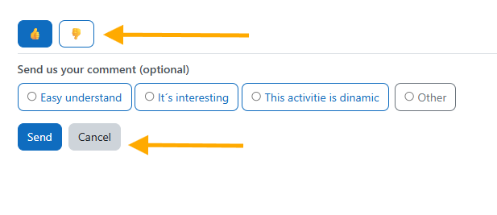

   - If the student selects **Other**, a text field will appear where they can write their own comment.

   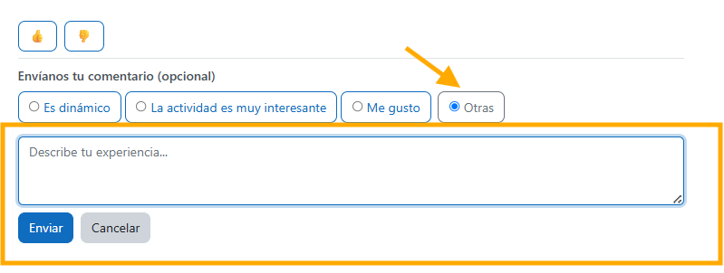

   - After clicking **Submit**, the student will see a confirmation message indicating that their feedback was successfully sent.

   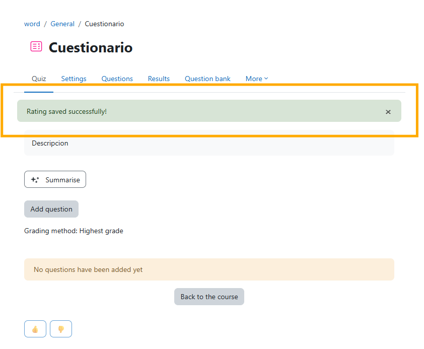

## Course Report for Teachers

- On the main course page, teachers can access the report from the **Reports** section.

  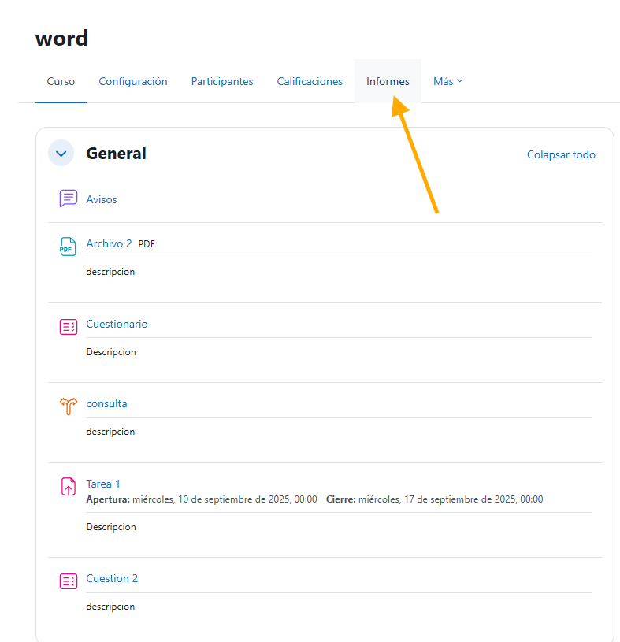

- Within **Reports**, navigate to **Activity/Resource Ratings Report**.

  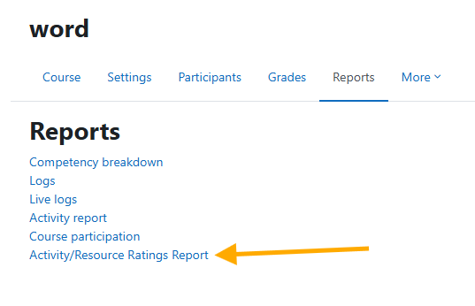

- Here, teachers will see the report summarizing ratings for all activities within their course.

  

- Similar to administrators, teachers will also have a button to generate a general AI analysis of activity ratings.

  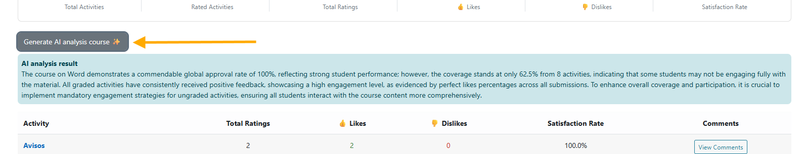

- Additionally, they can generate AI analyses of activity comments.

  

## License ##

2025 Data Curso LLC <https://datacurso.com>

This program is free software: you can redistribute it and/or modify it under
the terms of the GNU General Public License as published by the Free Software
Foundation, either version 3 of the License, or (at your option) any later
version.

This program is distributed in the hope that it will be useful, but WITHOUT ANY
WARRANTY; without even the implied warranty of MERCHANTABILITY or FITNESS FOR A
PARTICULAR PURPOSE.  See the GNU General Public License for more details.

You should have received a copy of the GNU General Public License along with
this program.  If not, see <https://www.gnu.org/licenses/>.
